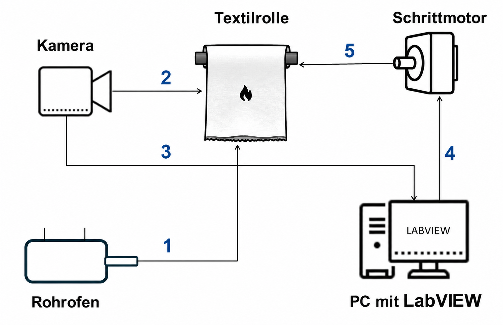

# Automated Control of Textile Pyrolysis Experiments Using Machine Vision

**Bachelor Thesis**  
**University of Duisburg-Essen**  
**Completed: July 2024**

---

## Overview

This repository contains my bachelor's thesis on the development of an automated control system for textile pyrolysis experiments using machine vision and digital PID control.

The project combines image processing, control engineering and LabVIEW to automatically regulate the movement of a textile sample during pyrolysis based on real-time camera images.

The project was conducted as part of a university research project investigating more environmentally friendly and health-conscious flame retardants for textiles.

---

## Objectives

- Develop an automated closed-loop control system
- Implement a digital PID controller in LabVIEW
- Process camera images in real time
- Automatically control the textile movement
- Experimentally validate the developed control strategy

---

## Technologies

**Programming & Software**
- LabVIEW

**Control Engineering**
- Digital PID Control
- Closed-loop Control

**Image Processing**
- Machine Vision
- Image Acquisition
- Pixel Intensity Analysis

**Hardware**
- IDS Industrial Camera
- Stepper Motor
- Tube Furnace

---

## Experimental Setup

The experimental setup consists of an industrial camera, a stepper motor, a custom-built test bench, a tube furnace and a LabVIEW-based control system.

The camera continuously captures images of the textile during pyrolysis. These images are processed in LabVIEW, where a digital PID controller automatically adjusts the motor speed to maintain the desired process conditions.

### Experimental Setup



---

## Methodology

The control algorithm continuously performs the following steps:

1. Capture camera images
2. Process the acquired images
3. Calculate the process variable
4. Compare the measured value with the reference value
5. Compute the PID controller output
6. Adjust the motor speed

Two image-based control variables were investigated:

- Burn mark width
- Average pixel intensity

---

## Results

The developed control system successfully automated the textile pyrolysis experiment.

The experimental evaluation demonstrated that average pixel intensity provided better control performance than burn mark width, resulting in improved control accuracy, stability and dynamic response.

---

## Repository Contents

```
README.md
Bachelor_Thesis.pdf
images/
```

---

## Documentation

The complete bachelor thesis is available in this repository.

📄 **Bachelor_Thesis.pdf**

📄 [Bachelor_Thesis.pdf](docs/Bachelor_Thesis.pdf)

---

## Author

**Ali Elbaradie**

Bachelor Thesis  
B.Sc. Mechanical Engineering  
University of Duisburg-Essen  
Completed: July 2024
