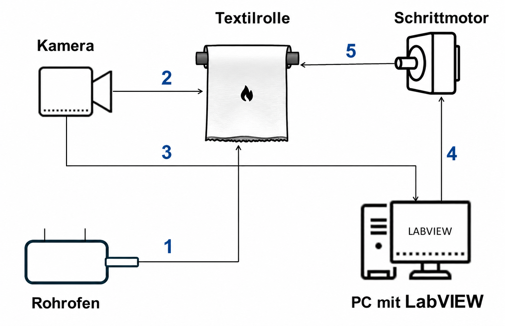
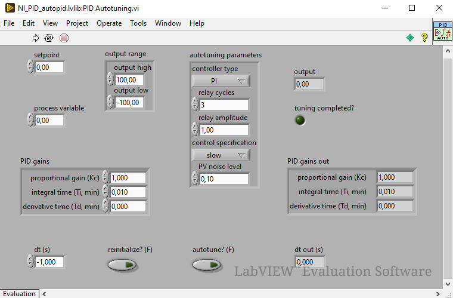
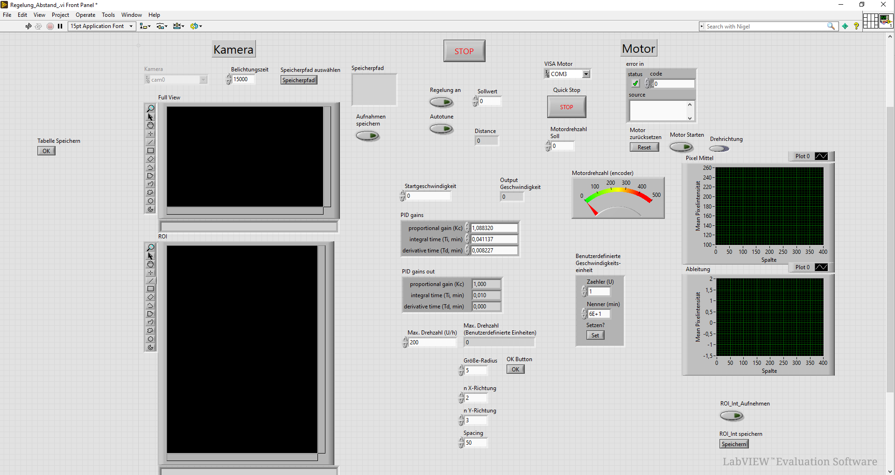
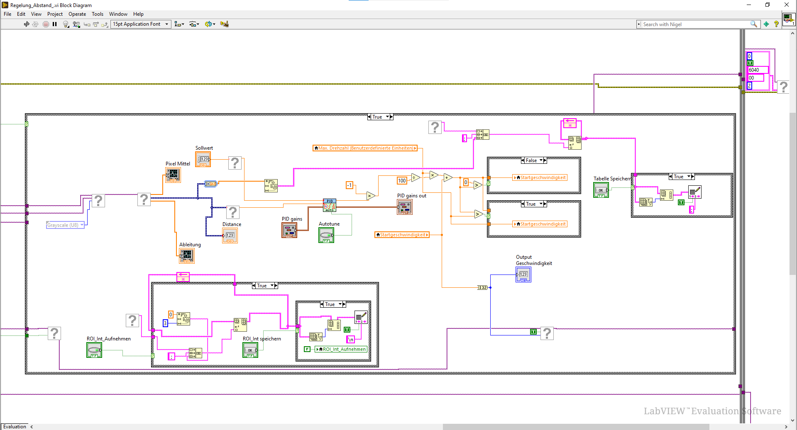
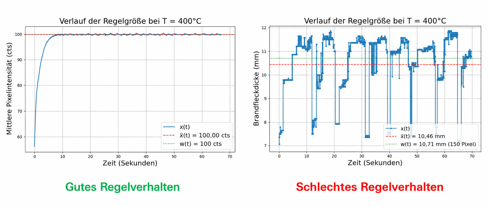

# Automated Control of Textile Pyrolysis Experiments Using Machine Vision

**Bachelor Thesis**<br>
**University of Duisburg-Essen**<br>
**Completed: July 2024**

---

## Overview

This repository contains my bachelor's thesis on the development of an automated control system for textile pyrolysis experiments using **machine vision** and **digital PID control**.

The project combines **image acquisition, image processing, control engineering, LabVIEW and experimental hardware** to automatically regulate the movement of a textile sample during pyrolysis based on real-time camera measurements. It was conducted as part of a university research project investigating more environmentally friendly and health-conscious flame retardants for textiles.

An industrial camera observes the pyrolysis process. The acquired images are processed in **LabVIEW** to extract process-relevant image features, which serve as feedback variables for a closed-loop PID controller. The controller adjusts the speed of a stepper motor that controls the movement of the textile.

Two image-based control strategies were investigated and compared: **burn mark width** and **mean pixel intensity** (see [Results](#results) for the outcome).

### Objectives

- Develop an automated closed-loop control system with a digital PID controller implemented in LabVIEW
- Acquire and process camera images in real time to extract process-relevant variables
- Automatically control textile movement via a stepper motor
- Investigate and experimentally compare different image-based control variables
- Evaluate and validate controller performance through experimental data analysis

---

## Technologies

### Programming & Software
- LabVIEW
- Python (NumPy, Matplotlib) — used for post-experiment data analysis and visualization (see [`analysis/`](analysis/))

### Control Engineering
- Digital PID Control / Closed-loop Control
- PID Autotuning / Self-optimizing Control
- Feedback Control

### Computer Vision & Image Processing
Core techniques used are summarized in [Key Computer Vision Concepts](#key-computer-vision-concepts) below.

### Hardware
- IDS Industrial Camera
- Stepper Motor with Integrated Controller
- Magnetic Absolute Encoder
- Custom-built Test Bench
- Tube Furnace
- Controlled Illumination

---

## Experimental Setup

The experimental setup consists of an **industrial camera, stepper motor, custom-built test bench, tube furnace, controlled illumination and a LabVIEW-based control system**.

The camera acts as the measurement device and continuously observes the textile during pyrolysis. The stepper motor acts as the actuator and controls the movement of the textile. The computer running LabVIEW serves as the interface between camera and motor, performing image processing and closed-loop control.

The camera featured a color sensor with a resolution of **1920 × 1200 pixels**, connected via USB 3.0. The motor was operated through a USB interface and featured an integrated magnetic absolute encoder.

### Laboratory Setup
<p align="center">

</p>

### Experimental System Overview
<p align="center">

</p>

---

## Control System

The system is implemented as a **closed-loop feedback control system**: the camera measures the current process state, LabVIEW extracts the selected process variable, compares it to the setpoint, and the PID controller calculates the required motor speed. The motor then repositions the textile relative to the pyrolysis zone, which changes the measured process variable — closing the feedback loop.

```text
                  Setpoint
                     │
                     ▼
              ┌─────────────┐
              │  Comparison │
              └──────┬──────┘
                     │ Error
                     ▼
              ┌─────────────┐
              │ LabVIEW PID │
              │  Controller │
              └──────┬──────┘
                     │ Motor Speed
                     ▼
              ┌─────────────┐
              │ Stepper     │
              │ Motor       │
              └──────┬──────┘
                     │
                     ▼
              ┌─────────────┐
              │   Textile   │
              │  Pyrolysis  │
              └──────┬──────┘
                     │
                     ▼
              ┌─────────────┐
              │ Industrial  │
              │   Camera    │
              └──────┬──────┘
                     │ Image Data
                     ▼
              ┌─────────────┐
              │    Image    │
              │  Processing │
              └──────┬──────┘
                     │
                     └────────── Feedback
```

---

## Computer Vision & Image Processing

The machine-vision system extracts measurable process information from the visual appearance of the pyrolyzing textile. Two approaches were investigated.

### 1. Burn Mark Width Detection

The acquired color image is converted to **grayscale**, reducing it to a single intensity representation. A horizontal image section (ROI) is extracted from the relevant textile area, and pixel intensities are **arithmetically averaged along the vertical direction**, resulting in a 1D intensity profile along the X-axis. The burn mark appears as a region of reduced intensity compared to the surrounding unburned textile.

```text
Camera Image → Grayscale Conversion → Image Section / ROI
   → Vertical Spatial Averaging → 1D Pixel-Intensity Profile
   → Savitzky–Golay Filtering → Central-Difference Derivative
   → Detection of Characteristic Extrema → Distance Between Points
   → Burn Mark Width
```

**Signal smoothing:** The extracted profile contains measurement noise, which is especially problematic when computing its derivative. A **Savitzky–Golay filter** (first-degree polynomial, local fitting) is applied to reduce noise while preserving the underlying signal shape.

**Derivative-based edge localization:** The smoothed profile is differentiated using the **central-difference method**. The burn mark boundaries appear as extrema in the derivative signal; the distance between them is the current burn mark width.

**Pixel-to-physical calibration:** The detected width is initially in pixels. A calibration measurement established the relationship:

```text
140 pixels ≈ 1 cm
14 pixels  ≈ 1 mm
```

This converts the burn mark width from pixels into millimeters.

### 2. Mean Pixel Intensity

This strategy uses the **mean pixel intensity of an image region** as the process variable. Before pyrolysis, the textile is bright (high intensity); as pyrolysis progresses, a darker burn mark develops and intensity decreases. The goal is to maintain a predefined mean intensity corresponding to the desired degree of pyrolysis.

```text
Camera Image → Color Channel Selection → Blue Channel Extraction
   → Image Region / ROI → Mean Pixel Intensity → PID Controller
```

**Blue channel selection:** Of the three color channels, the **blue channel** was selected because, based on experimental comparison of the intensity decay of all channels, it showed the strongest and fastest intensity response to burn mark formation.

**Spatial averaging:** Pixel intensities within the selected ROI are averaged into a single scalar process variable, which is passed to the PID controller.

---

## PID Autotuning

The LabVIEW **PID Autotuning VI** was used to determine suitable controller parameters via a **self-optimizing PID approach**: an initial parameter set is applied, the process is excited, and its dynamic response is observed. The autotuning routine then adjusts the parameters — iteratively refined with the objective of minimizing the **mean control error over time**. Users can also specify preferences such as desired response speed.

Controller parameters: **Kc** (proportional gain), **Ti** (integral time), **Td** (derivative time).
Tuning configuration parameters: controller type, relay cycles, relay amplitude, control specification, process-variable noise level.

<p align="center">

</p>

> *LabVIEW PID Autotuning VI used to determine and optimize the controller parameters based on the measured process response.*

---

## LabVIEW Implementation

The complete control system was implemented in **LabVIEW**, integrating camera acquisition, image processing, process-variable extraction, PID control, motor communication and user interaction:

- Camera image acquisition & real-time visualization
- Image-region (ROI) processing: grayscale conversion, color-channel extraction, pixel-intensity analysis, spatial averaging
- Signal smoothing and derivative calculation, burn mark width calculation, pixel-to-physical-unit conversion
- PID controller execution, parameter configuration and autotuning
- Motor speed control, communication and status monitoring
- Measurement/image storage and real-time process visualization
- Manual and automatic control operation

### Front Panel (User Interface)

The front panel is the centralized interface for operating and monitoring the system, providing:

- Live camera image and processed ROI display
- Motor controls (start/stop, reset, quick-stop, direction, speed) and status/error display
- Setpoint and PID parameter configuration, autotuning control, closed-loop activation
- Camera exposure-time configuration
- Pixel-intensity and derivative-signal visualization
- Image-processing parameter configuration

<p align="center">

</p>

### Control Block Diagram

The image below shows the section of the LabVIEW block diagram responsible for the **closed-loop control operation** — integrating image-processing results, process-variable calculation, PID control, speed calculation and motor-control logic.

<p align="center">

</p>

> *Section of the LabVIEW block diagram implementing the closed-loop control logic.*

---

## Data Analysis (Python)

In addition to the LabVIEW control system, part of the experimental data — specifically for the **burn mark width** control strategy — was analyzed and visualized in **Python** using **NumPy** and **Matplotlib**.

The recovered script [`analysis/plot_burn_mark_width.py`](analysis/plot_burn_mark_width.py) was used to post-process the raw measurement data recorded during the burn-mark-width experiments and to generate the corresponding comparison plots discussed in [Results](#results).

> **Note:** This script is a standalone analysis tool operating on previously recorded experimental data — it is not part of the real-time LabVIEW control loop. Additional analysis scripts (e.g. for the mean pixel intensity strategy) were used during the thesis but could not be recovered.

---

## Results

Experiments were conducted for both control strategies at different setpoints and temperatures (burn mark width: **400 °C and 500 °C**; pixel intensity: multiple target intensities at different temperatures).

The image-based control approach successfully converted the visual state of the pyrolysis process into a measurable variable usable directly within a feedback control loop. The experimental evaluation showed that **mean pixel intensity provided better control performance than burn mark width** under the investigated conditions.

Experimental data were analyzed and visualized in **Python** (NumPy for numerical processing, Matplotlib for visualization; see [Data Analysis (Python)](#data-analysis-python)) to:

- Evaluate controller performance and control accuracy
- Compare the two control variables
- Analyze steady-state behavior
- Compare stable vs. unstable controller behavior
- Assess the dynamic response of the control system

<p align="center">

</p>

> **Note:** The figure illustrates controller behavior obtained from experimental measurements.

---

## Demonstration

A video demonstration of the complete experimental system is currently **not available**. The project was conducted as a university laboratory research project, and the equipment used (industrial camera, stepper motor, test bench and associated lab hardware) is no longer available for recording a new demonstration.

The repository therefore focuses on the **LabVIEW implementation, computer-vision algorithms, control architecture, experimental setup, analysis results and project documentation**.

---

## Key Computer Vision Concepts

| Concept | Application in the Project |
|---|---|
| Image Acquisition | Real-time acquisition of textile pyrolysis images |
| Grayscale Conversion | Reduction of color image to a single intensity profile |
| Color Channel Extraction | Selection of the blue channel for intensity-based control |
| ROI / Image Section | Restriction of image analysis to the relevant textile region |
| Spatial Averaging | Reduction of image data to representative intensity values |
| 1D Intensity Profile | Analysis of intensity along the X-axis |
| Signal Smoothing | Noise reduction using a Savitzky–Golay filter |
| Numerical Differentiation | Central-difference derivative of the intensity profile |
| Feature Localization | Identification of burn mark boundaries from derivative extrema |
| Pixel Calibration | Conversion from pixel distance to physical dimensions |
| Mean Pixel Intensity | Extraction of a scalar process variable for feedback control |
| Experimental Signal Analysis | Evaluation of image-derived signals under different temperatures |

---

## Repository Structure

```text
Automated-Textile-Pyrolysis-Control/
│
├── README.md
│
├── LabVIEW/
│   └── Textile_Pyrolysis_Control.vi
│
├── analysis/
│   └── plot_burn_mark_width.py
│
├── images/
│   ├── experimental_setup_lab.jpg
│   ├── experimental_setup.png
│   ├── control_system.png
│   ├── image_processing.png
│   ├── pid_block.png
│   ├── regelung_block_diagram.png
│   ├── regelung_front_panel.png
│   └── results.png
│
└── docs/
    ├── bachelor_thesis.pdf
    ├── bachelor_thesis_Presentation.pdf
    └── bachelor_thesis_Presentation.pptx
```

> **Note:** The exact structure of the LabVIEW project files may depend on the LabVIEW project configuration and the files included in the repository.

---

## Documentation

The complete project documentation is available in the **docs** folder.

- 📄 [Bachelor Thesis (PDF)](docs/bachelor_thesis.pdf)
- 📄 [Final Presentation (PDF)](docs/bachelor_thesis_Presentation.pdf)
- 📊 [Presentation (PowerPoint)](docs/bachelor_thesis_Presentation.pptx)
- 🐍 [Python Analysis Script – Burn Mark Width](analysis/plot_burn_mark_width.py)

---

## Project Status

**Completed – July 2024**

The repository is maintained as a documentation and portfolio project containing the developed LabVIEW software, image-processing approach, control architecture, experimental results and thesis documentation.

---

---

## License

This project is licensed under the [MIT License](LICENSE).

---

## Author

**Ali Elbaradie**<br>
Bachelor Thesis<br>
B.Sc. Mechanical Engineering<br>
University of Duisburg-Essen<br>
**Completed: July 2024**
